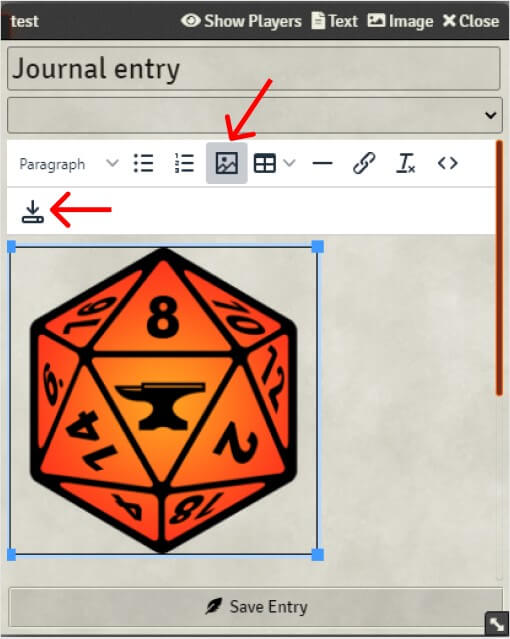
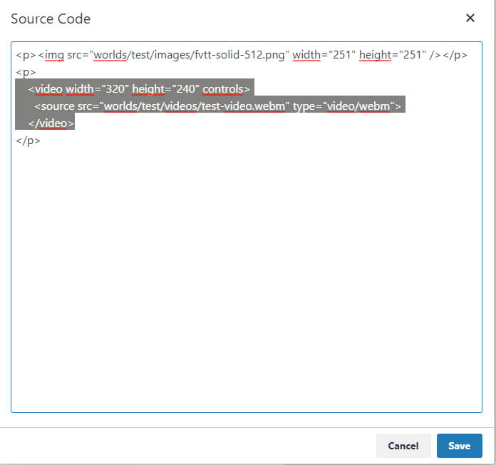
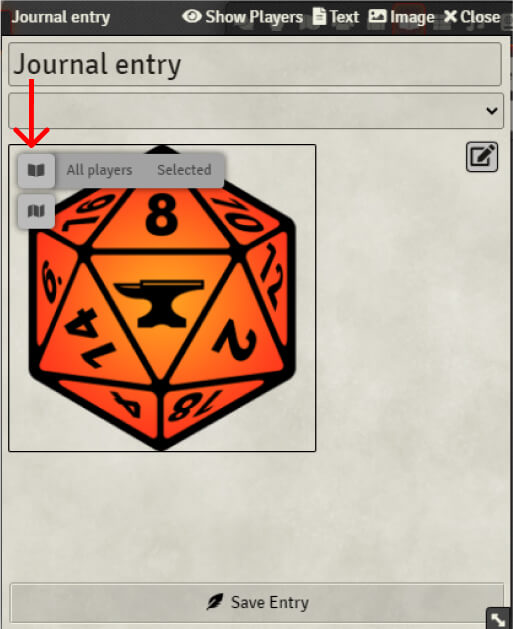
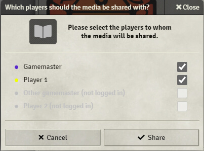
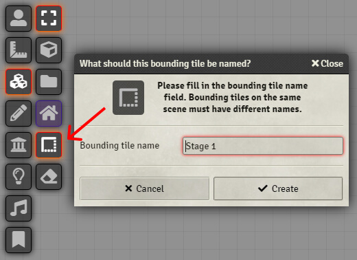
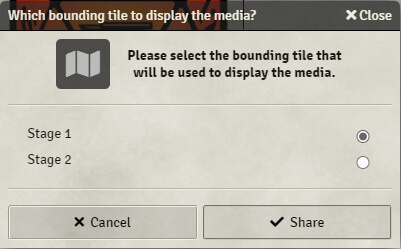
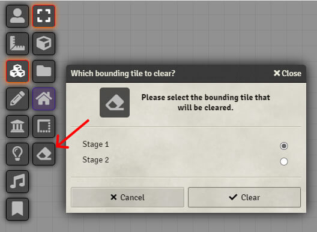
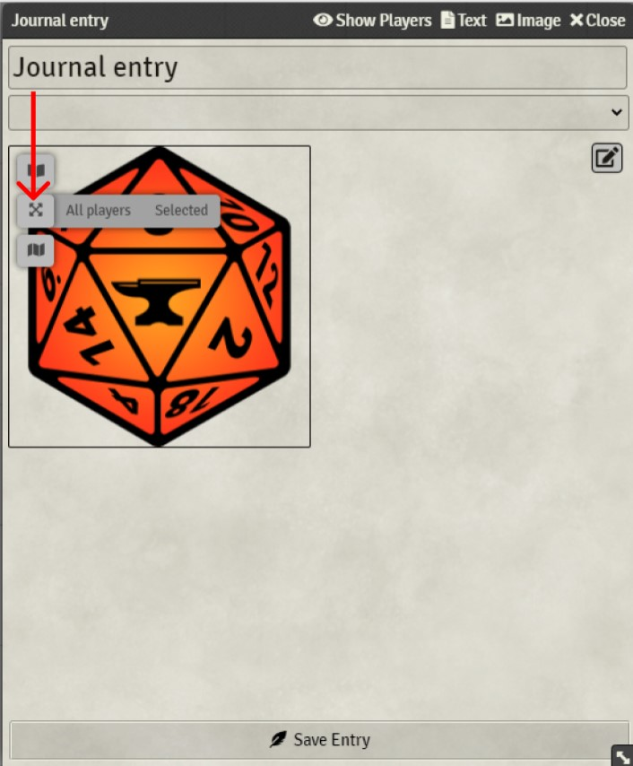
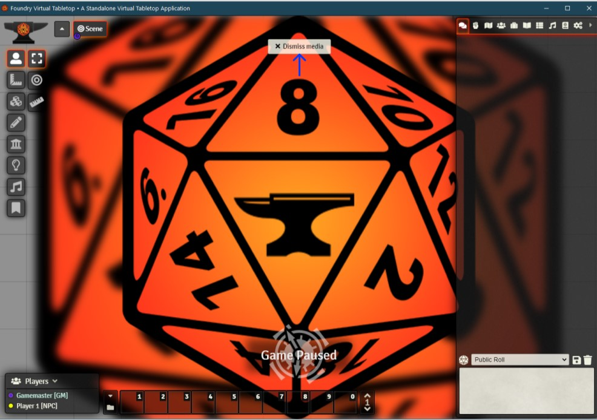

# Share Media
A module to easily share images and videos on a scene or in a popout to all or some players. This module is primarly focused on sharing illustrations (and others) without having to create multiple journal entries.

- Share embedded media in a journal entry
- Share embedded media in an actor sheet
- Share embedded media in an item sheet

This module is compatible with:
- [Kanka-Foundry](https://github.com/eXaminator/kanka-foundry)
- [GM Notes](https://github.com/syl3r86/gm-notes)

This module is inspired by the excellent [Journal-To-Canvas-Slideshow](https://github.com/EvanesceExotica/Journal-To-Canvas-Slideshow) module developed by EvanesceExotica.

# How-to
## 1. Install
Search "Share Media" in the modules installer, or copy paste this link: [https://github.com/DarKDinDoN/share-media/releases/latest/download/module.json](https://github.com/DarKDinDoN/share-media/releases/latest/download/module.json)

## 2. Insert a media using the foundry virtual tabletop text editor
#### a. Images
Simply use the "Insert/edit image" button and don't forget to save.



#### b. Videos

"Share Media" supports mp4 & webm videos. To insert a video in a text editor, click on the "Source code" button and copy/paste the following code:
```
<video width="320" height="240" controls>
  <source src="path/to/your-video.webm" type="video/webm">
</video>
```



Make sure to change the file path and the extension type. Then save.

_Note: videos are automatically played and **muted**._

## 3. Share an image or a video in a popout
Once an image or a video is inserted, hover over the media preview to display two buttons.



Hover over the first button to display two popout options:
- Click on "All players" to share the media to all players
- Click on "Selected" to share the media to some players



## 4. Share an image or a video on a scene
#### a. Bounding tile
To share an image or a video on a scene, you need to create a bounding tile on the scene. To do this, click on the "Create a bounding tile".
A bounding tile is a special type of tile automaticaly generated by this module. This bounding tile acts as some sort of area in which the media will be displayed. By default the bounding tile is created covering the whole scene canvas. You can resize a bouding tile just like a regular tile.



You can create multiple bounding tiles and therefore share multiple medias on the same scene!

#### b. Share
Hover over the second button to display two scene options:
- Click on "Fit" to share and resize the media and make sure it is fully visible
- Click on "Cover" to share and resize the media to cover the entire bounding tile (the media will most likely be cropped)


If multiple bounding tiles are created, clicking the "Fit" or "Cover" buttons will prompt to choose the bounding tile.



#### c. Clear

Click on the "Clear bounding tile" button and select the bounding tile to clear.



## 5. Share an image and video fullscreen
Once an image or a video is inserted, hover over the media preview to display two buttons.



Hover over the first button to display two popout options:
- Click on "All players" to share the media to all players
- Click on "Selected" to share the media to some players


Once the media is shared, a "Dismiss" button should appear. As the GM, you can click this button to dismiss the media for all players (only the GM can see this button).



## 6. Loop option (video only)
If the media is a video another button is displayed: the loop button option.  
This button controls if the video is to be shared as a looping video or not.

If the video is **not** set to loop, then the video container will be hidden once the video has ended.

A general setting allow the user to set the default looping option for all videos.

## 7. Notes
- "Share Media" creates a new layer just above the background layer (map & tiles)
- Videos are automatically played and muted
- If only one bounding tile is present on the scene the module won't prompt to choose between bounding tiles
- Resize a bounding tile to fit your needs
- When sharing a media, the source entity (journal entry, actor or item) will not be shared to the players. Only the media is.
